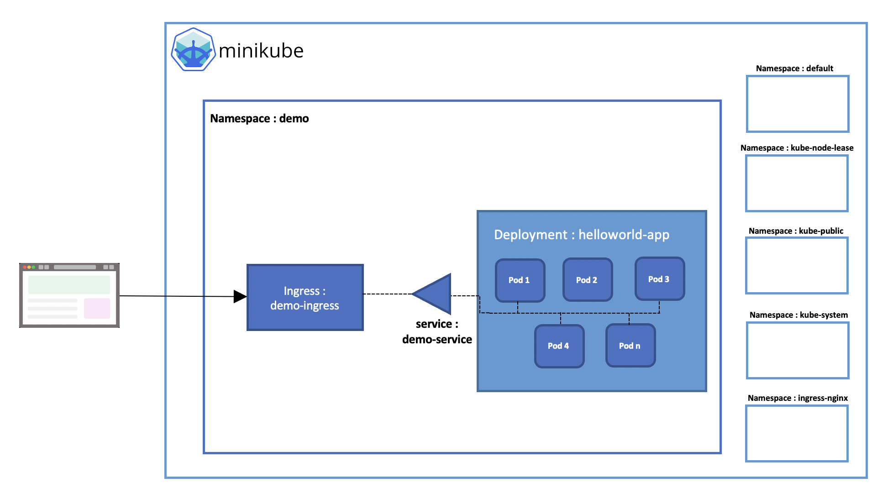
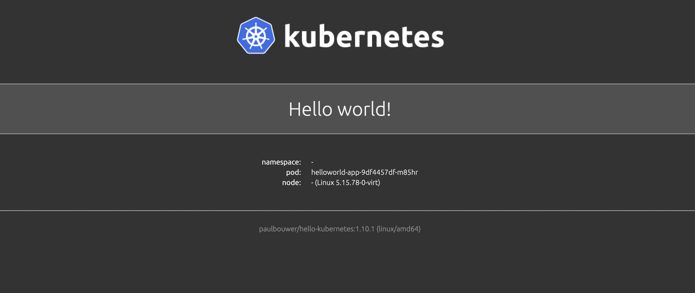

# Démo-kube

Dans cette démo on va déployer et exposer une application sur un cluster kubernetes en local (Minikube **version: v1.28.0**).

L'architecture de la démo est illustrée par le schéma suivant:

# 1- Creation du namespace demo

Par défaut le cluster contient 4 namespaces:
* default
* kube-node-lease
* kube-public
* kube-system

Pour créer un nouveau namespace (demo), on va utiliser le ficher '**namespace.yaml**' en exécutant la commande:

 >**kubectl apply -f namespace.yaml**

**PS**: on peut utiliser la commande suivante pour créer le namespace demo:

 >**kubectl create namespace demo**

Pour vérifier l'ajout du namespace, vérifiez l'output de cette commande:

 >**kubectl get namespaces**

# 2- Creation du déploiement helloworld-app

Pour créer le déploiement helloworld-app dans le namespace demo, on va utiliser le ficher '**deployment.yaml**' en exécutant la commande:

>**kubectl apply -f deployment.yaml**

Pour vérifier l'ajout du déploiement, vérifiez l'output de ces commandes:

 > **kubectl get deployments -n demo**

 > **kubectl describe deployments helloworld-app -n demo**

 > **kubectl get pods -n demo**

Le déploiement contient 5 replicas de conteneurs avec l'image '**paulbouwer/hello-kubernetes:1.10.1**'.

Il faut vérifier que la totalité de pods soit en état "Ready". 

En ca d'erreur **ImagePullBackOff** (le cluster n'arrive pas à faire le pull de l'image), utilisez la commande:

 >**minikube image pull paulbouwer/hello-kubernetes:1.10.1**

puis vérifiez que l'image existe dans la liste fournie par la commande:

 >**minikube image list** 

# 3- Creation du service demo-service

Pour exposer l'application helloworld-app, il faut créer un service permettant l'accès au deploiement helloworld-app (en utilisant le fichier **service.yaml**).

Exécutez la commande:

 >**kubectl apply -f service.yaml**

Pour vérifier la création du service **demo-service**, utilisez ces commandes:

 >**kubectl get service -n demo**

 >**kubectl describe service demo-service -n demo**

L'application helloworld-app écoute sur le port **8080**

# 4- Creation d'ingress demo-ingress:

"Un Ingress est un objet Kubernetes qui gère l'accès externe aux services dans un cluster, généralement du trafic HTTP.

Un Ingress peut fournir un équilibrage de charge, une terminaison TLS et un hébergement virtuel basé sur un nom."

 [source](https://kubernetes.io/fr/docs/concepts/services-networking/ingress/)

Pour activer le contrôleur NGINX Ingress (addon), exécutez la commande suivante:

 >**minikube addons enable ingress**

Vérifiez l'activation de l'addon:

 >**minikube addons list**

Une fois Ingress est activé, on remarque l'ajout d'un nouveau namespace "ingress-nginx" qui contient les objets ajoutés après l'activation d'Ingress:

 >**kubectl get all -n ingress-nginx**

Pour pouvoir accèder à notre application en local, on va créer un Ingress demo-ingress, on va utiliser le ficher '**ingress.yaml**' en exécutant la commande:

 >**kubectl apply -f ingress.yaml**

Pour vérifier la création du service **demo-service**, utilisez ces commandes:

 >**kubectl get ingress -n demo**

 >**kubectl describe ingress demo-ingress -n demo**

# 5- Test d'accès à l'application:

Pour tester l'accès à l'application via un navigateur, exécuter la commande:

 >**sudo minikube tunnel**

Tapez **localhost** dans un navigateur pour consulter l'application **helloworld-app**

